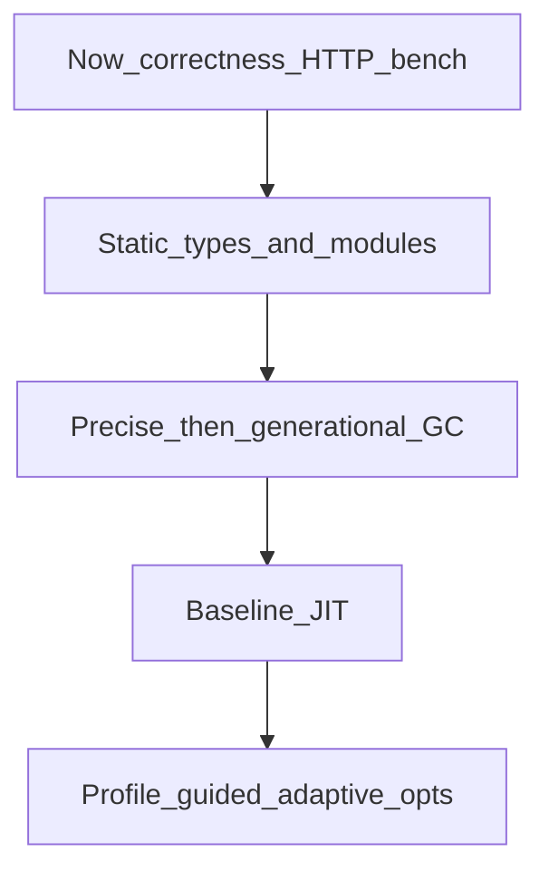

# Performance roadmap

## Purpose

Organize the path toward a low-level, highly abstract, eventually very fast
`lkjscript2026` runtime. This is aspiration and sequencing — not a release claim.

## Layers

### Now

Correct editor/runtime, package-root imports, hardcoded limits, thin TCP/HTTP
demo, and honest numeric benchmarks versus C.

### Static types and modules

Gradual annotations and checked defs; sealed modules later (consult before
breaking shared editor globals).

### GC

Replace bump-only allocation with precise mark-sweep, then generational
collection and write barriers in the host.

### Baseline JIT

Grow `JitHook` from a stub into a baseline native compiler for hot calls.

### Adaptive / profile-guided speed

Hot-path counters and specialization so long-running processes get faster
over time (PGO-style), without promising “world’s fastest” in marketing copy.

## Deferred

- Browser IDE (explicitly deferred)
- Full Rust-parity type system in one jump
- Claiming victory over C before measurements say so
