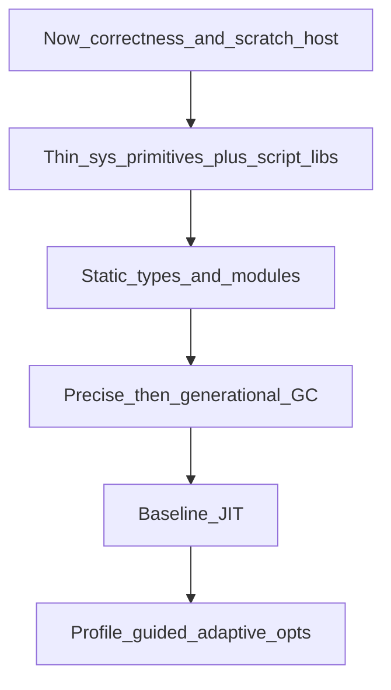

# Performance roadmap

## Purpose

Organize the path toward a low-level, highly abstract, eventually very fast
`lkjscript` runtime. This is aspiration and sequencing — not a release claim.

## Layers

### Now

Correct lkjedit/runtime behavior, package-root imports, hardcoded limits, thin TCP/HTTP
demo, honest numeric benchmarks versus C, and a scratch `lkjscript-sys`
layer (no crates.io OS helpers).

### Thin primitives + `.lkjml` libraries

Shrink fat host opcodes over time. Keep hot ops obvious so a future JIT can
specialize them; put policy (termios, sockets, buffering) in `.lkjml`.
See [decisions/scratch-host.md](../decisions/scratch-host.md).

### Static types and modules

Mandatory signatures, sized numeric types, checked defs, annotation-driven
polymorphism, and opaque handles have landed. Sealed modules remain later work
and must not break shared lkjedit globals before its repository extraction.

### GC

Precise mark-sweep has landed. Collection scheduling is allocation-driven: a
completed collection resets pressure even when the arena has more than 4,096
slots. The former `slots > 4096` condition stayed true after collection and
therefore ran a full heap trace before every VM instruction. A 20,000-iteration
Leibniz run exceeded 55 seconds while 2,000 iterations took 0.010 seconds,
exposing that cliff.

The immediate policy collects once per 1,024 allocations. Together with tail
frame reuse, the same debug-build benchmark completed 20,000 iterations in
0.091 seconds and 200,000 in 0.877 seconds on this checkout; the C comparison
at 20,000 took 0.001 seconds. These figures are diagnostic, not portable
marketing claims.

Alternatives retained for measurement are an adaptive threshold based on
post-collection live bytes, slot compaction, and a nursery plus old generation.
Combining adaptive growth with generations is likely best for long-lived
multi-process workloads, but it requires write barriers and representative
resident-set benchmarks first.

### Tail calls

The interpreter reuses the current frame when a `Call` is immediately followed
by `Return`. LKJML libraries use recursion for loops, so this peephole prevents
tail-recursive processes from retaining every frame and every heap temporary.
An explicit `TailCall` opcode was considered, but return-adjacent frame reuse
keeps bytecode stable and gives the same result for the current compiler.
Compiler-emitted tail opcodes remain useful if later control-flow lowering
makes adjacency unreliable; native tail jumps belong in the baseline JIT.

### Baseline JIT

Grow `JitHook` from a stub into a baseline native compiler for hot calls.

### Adaptive / profile-guided speed

Hot-path counters and specialization so long-running processes get faster
over time (PGO-style), without promising “world’s fastest” in marketing copy.

## Deferred

- Browser IDE (explicitly deferred)
- Full Rust-parity type system in one jump
- Claiming victory over C before measurements say so
